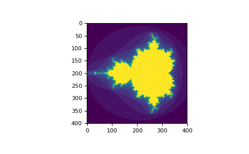
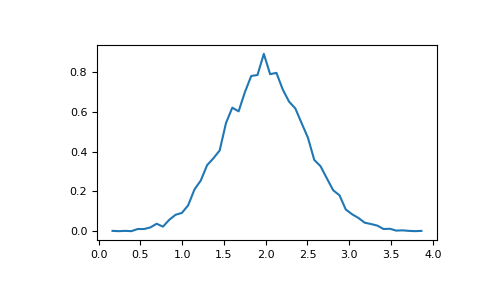

==================================
快速入门教程
==================================

----------------------------------
先决条件
----------------------------------

在阅读本教程之前，你应该了解一些Python的基础知识。如果你想复习一下，请回去看看Python教程。

如果你希望使用本教程中的示例，则还必须在计算机上安装一些软件。 有关说明，请参阅本指南的安装教程。

----------------------------------
基础知识
----------------------------------

NumPy的主要对象是同类型的多维数组。它是一张表，所有元素（通常是数字）的类型都相同，并通过正整数元组索引。在NumPy中，维度称为轴。轴的数目为rank。

例如，3D空间中的点的坐标 ``[1, 2, 1]`` 是rank为1的数组，因为它具有一个轴。该轴的长度为3。在下面的示例中，该数组有2个轴。
第一个轴（维度）的长度为2，第二个轴（维度）的长度为3。

.. code-block:: python

    [[ 1., 0., 0.],
    [ 0., 1., 2.]]

NumPy的数组类被称为ndarray。别名为 ``array``。 请注意，``numpy.array`` 与标准Python库类 ``array.array`` 不同，后者仅处理一维数组并提供较少的功能。 ``ndarray`` 对象则提供更关键的属性：

* **ndarray.ndim**：数组的轴（维度）的个数。在Python世界中，维度的数量被称为rank。
* **ndarray.shape**：数组的维度。这是一个整数的元组，表示每个维度中数组的大小。对于有n行和m列的矩阵，shape将是(n,m)。因此，``shape``元组的长度就是rank或维度的个数 ``ndim``。
* **ndarray.size**：数组元素的总数。这等于shape的元素的乘积。
* **ndarray.dtype**：一个描述数组中元素类型的对象。可以使用标准的Python类型创建或指定dtype。另外NumPy提供它自己的类型。例如numpy.int32、numpy.int16和numpy.float64。
* **ndarray.itemsize**：数组中每个元素的字节大小。例如，元素为 ``float64`` 类型的数组的 ``itemsize`` 为8（=64/8），而 ``complex32`` 类型的数组的 ``itemsize`` 为4（=32/8）。它等于 ``ndarray.dtype.itemsize`` 。
* **ndarray.data**：该缓冲区包含数组的实际元素。通常，我们不需要使用此属性，因为我们将使用索引访问数组中的元素。

^^^^^^^^^^^^^^^^^^^^^^^^^^^^^^^^^^^
一个典型的例子
^^^^^^^^^^^^^^^^^^^^^^^^^^^^^^^^^^^

.. code-block:: python

    >>> import numpy as np
    >>> a = np.arange(15).reshape(3, 5)
    >>> a
    array([[ 0,  1,  2,  3,  4],
           [ 5,  6,  7,  8,  9],
           [10, 11, 12, 13, 14]])
    >>> a.shape
    (3, 5)
    >>> a.ndim
    2
    >>> a.dtype.name
    'int64'
    >>> a.itemsize
    8
    >>> a.size
    15
    >>> type(a)
    <type 'numpy.ndarray'>
    >>> b = np.array([6, 7, 8])
    >>> b
    array([6, 7, 8])
    >>> type(b)
    <type 'numpy.ndarray'>

^^^^^^^^^^^^^^^^^^^^^^^^^^^^^^^^^^^
数组的创建
^^^^^^^^^^^^^^^^^^^^^^^^^^^^^^^^^^^

有几种创建数组的方法。

例如，你可以使用array函数从常规Python列表或元组中创建数组。得到的数组的类型是从Python列表中元素的类型推导出来的。

.. code-block:: python

    >>> import numpy as np
    >>> a = np.array([2,3,4])
    >>> a
    array([2, 3, 4])
    >>> a.dtype
    dtype('int64')
    >>> b = np.array([1.2, 3.5, 5.1])
    >>> b.dtype
    dtype('float64')

一个常见的错误在于使用多个数值参数调用 ``array`` 函数，而不是提供一个数字列表（List）作为参数。

.. code-block:: python

    >>> a = np.array(1,2,3,4)    # WRONG
    >>> a = np.array([1,2,3,4])  # RIGHT

``array`` 将序列的序列转换成二维数组，将序列的序列的序列转换成三维数组，等等。

.. code-block:: python

    >>> b = np.array([(1.5,2,3), (4,5,6)])
    >>> b
    array([[ 1.5,  2. ,  3. ],
           [ 4. ,  5. ,  6. ]])

数组的类型也可以在创建时明确指定：

.. code-block:: python

    >>> c = np.array( [ [1,2], [3,4] ], dtype=complex )
    >>> c
    array([[ 1.+0.j,  2.+0.j],
           [ 3.+0.j,  4.+0.j]])

通常，数组的元素最初是未知的，但它的大小是已知的。因此，NumPy提供了几个函数来创建具有初始占位符内容的数组。这就减少了数组增长的必要，因为数组增长的操作花费很大。

函数 ``zeros`` 创建一个由0组成的数组，函数 ``ones`` 创建一个由1数组的数组，函数 ``empty`` 内容是随机的并且取决于存储器的状态。默认情况下，创建的数组的dtype是 ``float64``。

.. code-block:: python

    >>> np.zeros( (3,4) )
    array([[ 0.,  0.,  0.,  0.],
           [ 0.,  0.,  0.,  0.],
           [ 0.,  0.,  0.,  0.]])
    >>> np.ones( (2,3,4), dtype=np.int16 )                # dtype can also be specified
    array([[[ 1, 1, 1, 1],
            [ 1, 1, 1, 1],
            [ 1, 1, 1, 1]],
           [[ 1, 1, 1, 1],
            [ 1, 1, 1, 1],
            [ 1, 1, 1, 1]]], dtype=int16)
    >>> np.empty( (2,3) )                                 # uninitialized, output may vary
    array([[  3.73603959e-262,   6.02658058e-154,   6.55490914e-260],
           [  5.30498948e-313,   3.14673309e-307,   1.00000000e+000]])
    
要创建数字序列，NumPy提供了一个类似于 ``range`` 的函数，该函数返回数组而不是列表。

.. code-block:: python

    >>> np.arange( 10, 30, 5 )
    array([10, 15, 20, 25])
    >>> np.arange( 0, 2, 0.3 )                 # it accepts float arguments
    array([ 0. ,  0.3,  0.6,  0.9,  1.2,  1.5,  1.8])

当 ``arange`` 与浮点参数一起使用时，由于浮点数的精度是有限的，通常不可能预测获得的元素数量。出于这个原因，通常最好使用函数 ``linspace`` ，它接收我们想要的元素数量而不是步长作为参数：

.. code-block:: python

    >>> from numpy import pi
    >>> np.linspace( 0, 2, 9 )                 # 9 numbers from 0 to 2
    array([ 0.  ,  0.25,  0.5 ,  0.75,  1.  ,  1.25,  1.5 ,  1.75,  2.  ])
    >>> x = np.linspace( 0, 2*pi, 100 )        # useful to evaluate function at lots of points
    >>> f = np.sin(x)

另见：

    `array <http://#>`_, zeros, zeros_like, ones, ones_like, empty, empty_like, arange, linspace, numpy.random.rand, numpy.random.randn, fromfunction, fromfile

^^^^^^^^^^^^^^^^^^^^^^^^^^^^^^^^^^^
打印数组
^^^^^^^^^^^^^^^^^^^^^^^^^^^^^^^^^^^

当你打印数组时，NumPy以与嵌套列表类似的方式显示它，但是具有以下布局：

* 最后一个轴从左到右打印，
* 倒数第二个从上到下打印，
* 其余的也从上到下打印，每个切片与下一个用空行分开。

一维数组被打印为行、二维为矩阵和三维为矩阵列表。

.. code-block:: python

	>>> a = np.arange(6)                         # 1d array
	>>> print(a)
	[0 1 2 3 4 5]
	>>>
	>>> b = np.arange(12).reshape(4,3)           # 2d array
	>>> print(b)
	[[ 0  1  2]
	 [ 3  4  5]
	 [ 6  7  8]
	 [ 9 10 11]]
	>>>
	>>> c = np.arange(24).reshape(2,3,4)         # 3d array
	>>> print(c)
	[[[ 0  1  2  3]
	  [ 4  5  6  7]
	  [ 8  9 10 11]]
	 [[12 13 14 15]
	  [16 17 18 19]
	  [20 21 22 23]]]

有关 ``reshape`` 的详情，请参阅下文。

如果数组太大而无法打印，NumPy将自动跳过数组的中心部分并仅打印角点：

.. code-block:: python

    >>> print(np.arange(10000))
    [   0    1    2 ..., 9997 9998 9999]
    >>>
    >>> print(np.arange(10000).reshape(100,100))
    [[   0    1    2 ...,   97   98   99]
     [ 100  101  102 ...,  197  198  199]
     [ 200  201  202 ...,  297  298  299]
     ...,
     [9700 9701 9702 ..., 9797 9798 9799]
     [9800 9801 9802 ..., 9897 9898 9899]
     [9900 9901 9902 ..., 9997 9998 9999]]

要禁用此行为并强制NumPy打印整个数组，你可以使用 ``set_printoptions`` 更改打印选项。

.. code-block:: python

    >>> np.set_printoptions(threshold=np.nan)

^^^^^^^^^^^^^^^^^^^^^^^^^^^^^^^^^^^
基本操作
^^^^^^^^^^^^^^^^^^^^^^^^^^^^^^^^^^^
数组上的算术运算符使用元素级别。一个新的数组被创建并填充结果。

.. code-block:: python

    >>> a = np.array( [20,30,40,50] )
    >>> b = np.arange( 4 )
    >>> b
    array([0, 1, 2, 3])
    >>> c = a-b
    >>> c
    array([20, 29, 38, 47])
    >>> b**2
    array([0, 1, 4, 9])
    >>> 10*np.sin(a)
    array([ 9.12945251, -9.88031624,  7.4511316 , -2.62374854])
    >>> a<35
    array([ True, True, False, False])

与许多矩阵语言不同，乘法运算符 ``*`` 的运算在NumPy数组中是元素级别的。矩阵乘积可以使用 ``dot`` 函数或方法执行：

.. code-block:: python

    >>> A = np.array( [[1,1],
    ...             [0,1]] )
    >>> B = np.array( [[2,0],
    ...             [3,4]] )
    >>> A*B                         # elementwise product
    array([[2, 0],
           [0, 4]])
    >>> A.dot(B)                    # matrix product
    array([[5, 4],
           [3, 4]])
    >>> np.dot(A, B)                # another matrix product
    array([[5, 4],
           [3, 4]])

某些操作（例如+=和*=）适用于修改现有数组，而不是创建新数组。

.. code-block:: python

    >>> a = np.ones((2,3), dtype=int)
    >>> b = np.random.random((2,3))
    >>> a *= 3
    >>> a
    array([[3, 3, 3],
           [3, 3, 3]])
    >>> b += a
    >>> b
    array([[ 3.417022  ,  3.72032449,  3.00011437],
           [ 3.30233257,  3.14675589,  3.09233859]])
    >>> a += b                  # b is not automatically converted to integer type
    Traceback (most recent call last):
      ...
    TypeError: Cannot cast ufunc add output from dtype('float64') to dtype('int64') with casting rule 'same_kind'

当使用不同类型的数组操作时，结果数组的类型对应于更一般或更精确的数组（称为向上转换的行为）。

.. code-block:: python

    >>> a = np.ones(3, dtype=np.int32)
    >>> b = np.linspace(0,pi,3)
    >>> b.dtype.name
    'float64'
    >>> c = a+b
    >>> c
    array([ 1.        ,  2.57079633,  4.14159265])
    >>> c.dtype.name
    'float64'
    >>> d = np.exp(c*1j)
    >>> d
    array([ 0.54030231+0.84147098j, -0.84147098+0.54030231j,
           -0.54030231-0.84147098j])
    >>> d.dtype.name
    'complex128'

许多一元运算，例如计算数组中所有元素的总和，都是作为 ``ndarray`` 类的方法实现的。

.. code-block:: python

    >>> a = np.random.random((2,3))
    >>> a
    array([[ 0.18626021,  0.34556073,  0.39676747],
           [ 0.53881673,  0.41919451,  0.6852195 ]])
    >>> a.sum()
    2.5718191614547998
    >>> a.min()
    0.1862602113776709
    >>> a.max()
    0.6852195003967595

默认情况下，这些操作适用于数组，就好像它是数字列表一样，无论其形状如何。但是，通过指定 ``axis`` 参数，你可以沿着数组的指定轴应用操作：

.. code-block:: python

    >>> b = np.arange(12).reshape(3,4)
    >>> b
    array([[ 0,  1,  2,  3],
           [ 4,  5,  6,  7],
           [ 8,  9, 10, 11]])
    >>>
    >>> b.sum(axis=0)                            # sum of each column
    array([12, 15, 18, 21])
    >>>
    >>> b.min(axis=1)                            # min of each row
    array([0, 4, 8])
    >>>
    >>> b.cumsum(axis=1)                         # cumulative sum along each row
    array([[ 0,  1,  3,  6],
           [ 4,  9, 15, 22],
           [ 8, 17, 27, 38]])

^^^^^^^^^^^^^^^^^^^^^^^^^^^^^^^^^^^
通用函数
^^^^^^^^^^^^^^^^^^^^^^^^^^^^^^^^^^^
NumPy提供了常见的数学函数，如sin，cos和exp。In NumPy, these are called “universal functions”( ``ufunc`` ). 在NumPy中，这些函数在数组上按元素级别操作，产生一个数组作为输出。

.. code-block:: python

    >>> B = np.arange(3)
    >>> B
    array([0, 1, 2])
    >>> np.exp(B)
    array([ 1.        ,  2.71828183,  7.3890561 ])
    >>> np.sqrt(B)
    array([ 0.        ,  1.        ,  1.41421356])
    >>> C = np.array([2., -1., 4.])
    >>> np.add(B, C)
    array([ 2.,  0.,  6.])

另见：

    all, any, apply_along_axis, argmax, argmin, argsort, average, bincount, ceil, clip, conj, corrcoef, cov, cross, cumprod, cumsum, diff, dot, floor, inner, inv, lexsort, max, maximum, mean, median, min, minimum, nonzero, outer, prod, re, round, sort, std, sum, trace, transpose, var, vdot, vectorize, where

^^^^^^^^^^^^^^^^^^^^^^^^^^^^^^^^^^^
索引、切片和迭代
^^^^^^^^^^^^^^^^^^^^^^^^^^^^^^^^^^^

一维数组可以被索引，切片和迭代，就像列出和其他Python序列一样。

.. code-block:: python

    >>> a = np.arange(10)**3
    >>> a
    array([  0,   1,   8,  27,  64, 125, 216, 343, 512, 729])
    >>> a[2]
    8
    >>> a[2:5]
    array([ 8, 27, 64])
    >>> a[:6:2] = -1000    # equivalent to a[0:6:2] = -1000; from start to position 6, exclusive, set every 2nd element to -1000
    >>> a
    array([-1000,     1, -1000,    27, -1000,   125,   216,   343,   512,   729])
    >>> a[ : :-1]                                 # reversed a
    array([  729,   512,   343,   216,   125, -1000,    27, -1000,     1, -1000])
    >>> for i in a:
    ...     print(i**(1/3.))
    ...
    nan
    1.0
    nan
    3.0
    nan
    5.0
    6.0
    7.0
    8.0
    9.0

**多维（Multidimensional）** 数组每个轴可以有一个索引。 这些索在元组中以逗号分隔给出：

.. code-block:: python

    >>> def f(x,y):
    ...     return 10*x+y
    ...
    >>> b = np.fromfunction(f,(5,4),dtype=int)
    >>> b
    array([[ 0,  1,  2,  3],
           [10, 11, 12, 13],
           [20, 21, 22, 23],
           [30, 31, 32, 33],
           [40, 41, 42, 43]])
    >>> b[2,3]
    23
    >>> b[0:5, 1]                       # each row in the second column of b
    array([ 1, 11, 21, 31, 41])
    >>> b[ : ,1]                        # equivalent to the previous example
    array([ 1, 11, 21, 31, 41])
    >>> b[1:3, : ]                      # each column in the second and third row of b
    array([[10, 11, 12, 13],
           [20, 21, 22, 23]])

当提供比轴数更少的索引时，缺失的索引被认为是一个完整切片 ``:``

.. code-block:: python

    >>> b[-1]                                  # the last row. Equivalent to b[-1,:]
    array([40, 41, 42, 43])

``b[i]`` 方括号中的表达式 ``i`` 被视为后面紧跟着 ``:`` 的多个实例，用于表示剩余轴。NumPy也允许你使用三个点写为 ``b[i,...]``。

三个点（ ``...`` ）表示产生完整索引元组所需的冒号。例如，如果 ``x`` 是rank为的5数组（即，它具有5个轴），则

* ``x[1,2,...]`` 等于 ``x[1,2,:,:,:]``。
* ``x[...,3]`` 等效于 ``x[:,:,:,:,3]``。
* ``x[4,...,5,:]`` 等效于 ``x[4,:,:,5,:]``。

.. code-block:: python

    >>> c = np.array( [[[  0,  1,  2],               # a 3D array (two stacked 2D arrays)
    ...                 [ 10, 12, 13]],
    ...                [[100,101,102],
    ...                 [110,112,113]]])
    >>> c.shape
    (2, 2, 3)
    >>> c[1,...]                                   # same as c[1,:,:] or c[1]
    array([[100, 101, 102],
           [110, 112, 113]])
    >>> c[...,2]                                   # same as c[:,:,2]
    array([[  2,  13],
           [102, 113]])

**迭代（Iterating）** 多维数组是相对于第一个轴完成的：

.. code-block:: python

    >>> for row in b:
    ...     print(row)
    ...
    [0 1 2 3]
    [10 11 12 13]
    [20 21 22 23]
    [30 31 32 33]
    [40 41 42 43]

但是，如果想要对数组中的每个元素执行操作，可以使用 ``flat`` 属性，该属性是数组中所有元素的迭代器：

.. code-block:: python

    >>> for element in b.flat:
    ...     print(element)
    ...
    0
    1
    2
    3
    10
    11
    12
    13
    20
    21
    22
    23
    30
    31
    32
    33
    40
    41
    42
    43

另见：

    Indexing, Indexing (reference), newaxis, ndenumerate, indices

----------------------------------
形状操作
----------------------------------

^^^^^^^^^^^^^^^^^^^^^^^^^^^^^^^^^^^
更改数组的形状
^^^^^^^^^^^^^^^^^^^^^^^^^^^^^^^^^^^
一个数组具有由每个轴上的元素数量给出的形状：

.. code-block:: python

    >>> a = np.floor(10*np.random.random((3,4)))
    >>> a
    array([[ 2.,  8.,  0.,  6.],
           [ 4.,  5.,  1.,  1.],
           [ 8.,  9.,  3.,  6.]])
    >>> a.shape
    (3, 4)

数组的形状可以通过各种命令进行更改。请注意，以下三个命令都返回一个修改后的数组，但不要更改原始数组：

.. code-block:: python

    >>> a.ravel()  # returns the array, flattened
    array([ 2.,  8.,  0.,  6.,  4.,  5.,  1.,  1.,  8.,  9.,  3.,  6.])
    >>> a.reshape(6,2)  # returns the array with a modified shape
    array([[ 2.,  8.],
           [ 0.,  6.],
           [ 4.,  5.],
           [ 1.,  1.],
           [ 8.,  9.],
           [ 3.,  6.]])
    >>> a.T  # returns the array, transposed
    array([[ 2.,  4.,  8.],
           [ 8.,  5.,  9.],
           [ 0.,  1.,  3.],
           [ 6.,  1.,  6.]])
    >>> a.T.shape
    (4, 3)
    >>> a.shape
    (3, 4)

由ravel()产生的数组中元素的顺序通常是“C风格”，也就是说，最右边的索引“改变最快”，所以[0,0]之后的元素是[0,1] 。如果数组被重新塑造成其他形状，数组又被视为“C-style”。NumPy通常创建按此顺序存储的数组，因此ravel()通常不需要复制其参数，但如果数组是通过切片另一个数组或使用不寻常选项创建的，则可能需要复制它。函数ravel()和reshape()也可以通过使用可选参数来指示使用FORTRAN风格的数组，其中最左侧的索引更改速度最快。

``reshape`` 函数返回具有修改形状的参数，而 ``ndarray.resize`` 方法修改数组本身：

.. code-block:: python

    >>> a
    array([[ 2.,  8.,  0.,  6.],
           [ 4.,  5.,  1.,  1.],
           [ 8.,  9.,  3.,  6.]])
    >>> a.resize((2,6))
    >>> a
    array([[ 2.,  8.,  0.,  6.,  4.,  5.],
           [ 1.,  1.,  8.,  9.,  3.,  6.]])

如果在reshape操作中将维度指定为-1，则会自动计算其他维度：

.. code-block:: python

    >>> a.reshape(3,-1)
    array([[ 2.,  8.,  0.,  6.],
           [ 4.,  5.,  1.,  1.],
           [ 8.,  9.,  3.,  6.]])

另见：

    ndarray.shape, reshape, resize, ravel

^^^^^^^^^^^^^^^^^^^^^^^^^^^^^^^^^^^
将不同数组堆叠在一起
^^^^^^^^^^^^^^^^^^^^^^^^^^^^^^^^^^^

几个数组可以沿不同的轴堆叠在一起：

.. code-block:: python

    >>> a = np.floor(10*np.random.random((2,2)))
    >>> a
    array([[ 8.,  8.],
           [ 0.,  0.]])
    >>> b = np.floor(10*np.random.random((2,2)))
    >>> b
    array([[ 1.,  8.],
           [ 0.,  4.]])
    >>> np.vstack((a,b))
    array([[ 8.,  8.],
           [ 0.,  0.],
           [ 1.,  8.],
           [ 0.,  4.]])
    >>> np.hstack((a,b))
    array([[ 8.,  8.,  1.,  8.],
           [ 0.,  0.,  0.,  4.]])

函数 ``column_stack`` 将1D数组作为列叠加到2D数组中。它相当于仅用于二维数组的 ``hstack``：

.. code-block:: python

    >>> from numpy import newaxis
    >>> np.column_stack((a,b))     # with 2D arrays
    array([[ 8.,  8.,  1.,  8.],
           [ 0.,  0.,  0.,  4.]])
    >>> a = np.array([4.,2.])
    >>> b = np.array([3.,8.])
    >>> np.column_stack((a,b))     # returns a 2D array
    array([[ 4., 3.],
           [ 2., 8.]])
    >>> np.hstack((a,b))           # the result is different
    array([ 4., 2., 3., 8.])
    >>> a[:,newaxis]               # this allows to have a 2D columns vector
    array([[ 4.],
           [ 2.]])
    >>> np.column_stack((a[:,newaxis],b[:,newaxis]))
    array([[ 4.,  3.],
           [ 2.,  8.]])
    >>> np.hstack((a[:,newaxis],b[:,newaxis]))   # the result is the same
    array([[ 4.,  3.],
           [ 2.,  8.]])

另一方面，对于任何输入数组，函数 ``row_stack`` 相当于 ``vstack``。一般来说，对于具有两个以上维度的数组，``hstack`` 沿第二轴堆叠，``vstack`` 沿第一轴堆叠，``concatenate`` 允许一个可选参数，给出串接应该发生的轴。

**请注意**

在复杂情况下，``r_`` 和 ``c_`` 可用于通过沿一个轴叠加数字来创建数组。它们允许使用范围字面量（“：”）

.. code-block:: python

    >>> np.r_[1:4,0,4]
    array([1, 2, 3, 0, 4])

当以数组作为参数使用时，``r_`` 和 ``c_`` 类似于其默认行为中的 ``vstack`` 和 ``hstack`` ，但是允许一个可选参数给出要沿其连接的轴的编号。

另见：

    hstack, vstack, column_stack, concatenate, c\_, r\_

^^^^^^^^^^^^^^^^^^^^^^^^^^^^^^^^^^^^^^^^^^^^^^^^^^^^^
将一个数组分成几个较小的数组
^^^^^^^^^^^^^^^^^^^^^^^^^^^^^^^^^^^^^^^^^^^^^^^^^^^^^

使用 ``hsplit`` ，可以沿其水平轴拆分数组，通过指定要返回的均匀划分的数组数量，或通过指定要在其后进行划分的列：

.. code-block:: python

    >>> a = np.floor(10*np.random.random((2,12)))
    >>> a
    array([[ 9.,  5.,  6.,  3.,  6.,  8.,  0.,  7.,  9.,  7.,  2.,  7.],
           [ 1.,  4.,  9.,  2.,  2.,  1.,  0.,  6.,  2.,  2.,  4.,  0.]])
    >>> np.hsplit(a,3)   # Split a into 3
    [array([[ 9.,  5.,  6.,  3.],
           [ 1.,  4.,  9.,  2.]]), array([[ 6.,  8.,  0.,  7.],
           [ 2.,  1.,  0.,  6.]]), array([[ 9.,  7.,  2.,  7.],
           [ 2.,  2.,  4.,  0.]])]
    >>> np.hsplit(a,(3,4))   # Split a after the third and the fourth column
    [array([[ 9.,  5.,  6.],
           [ 1.,  4.,  9.]]), array([[ 3.],
           [ 2.]]), array([[ 6.,  8.,  0.,  7.,  9.,  7.,  2.,  7.],
           [ 2.,  1.,  0.,  6.,  2.,  2.,  4.,  0.]])]

``vsplit`` 沿纵轴分割，并且 ``array_split`` 允许指定沿哪个轴分割。

----------------------------------
复制和视图
----------------------------------

当计算和操作数组时，它们的数据有时被复制到新的数组中，有时不复制。对于初学者来说，这经常是一个混乱的来源。有三种情况：

^^^^^^^^^^^^^^^^^^^^^^^^^^^^^^^^^^
完全不复制
^^^^^^^^^^^^^^^^^^^^^^^^^^^^^^^^^^

简单赋值不会创建数组对象或其数据的拷贝。

.. code-block:: python

    >>> a = np.arange(12)
    >>> b = a            # no new object is created
    >>> b is a           # a and b are two names for the same ndarray object
    True
    >>> b.shape = 3,4    # changes the shape of a
    >>> a.shape
    (3, 4)

Python将可变对象作为引用传递，所以函数调用不会复制。

.. code-block:: python

    >>> def f(x):
    ...     print(id(x))
    ...
    >>> id(a)                           # id is a unique identifier of an object
    148293216
    >>> f(a)
    148293216

^^^^^^^^^^^^^^^^^^^^^^^^^^^^^^^^^^
视图或浅复制
^^^^^^^^^^^^^^^^^^^^^^^^^^^^^^^^^^

不同的数组对象可以共享相同的数据。 ``view`` 方法创建一个新的数组对象，它查看相同的数据。

.. code-block:: python

    >>> c = a.view()
    >>> c is a
    False
    >>> c.base is a                        # c is a view of the data owned by a
    True
    >>> c.flags.owndata
    False
    >>>
    >>> c.shape = 2,6                      # a's shape doesn't change
    >>> a.shape
    (3, 4)
    >>> c[0,4] = 1234                      # a's data changes
    >>> a
    array([[   0,    1,    2,    3],
           [1234,    5,    6,    7],
           [   8,    9,   10,   11]])

对数组切片返回一个视图：

.. code-block:: python

    >>> s = a[ : , 1:3]     # spaces added for clarity; could also be written "s = a[:,1:3]"
    >>> s[:] = 10           # s[:] is a view of s. Note the difference between s=10 and s[:]=10
    >>> a
    array([[   0,   10,   10,    3],
           [1234,   10,   10,    7],
           [   8,   10,   10,   11]])

----------------------------------
深拷贝
----------------------------------

``copy`` 方法生成数组及其数据的完整拷贝。

.. code-block:: python

    >>> d = a.copy()                          # a new array object with new data is created
    >>> d is a
    False
    >>> d.base is a                           # d doesn't share anything with a
    False
    >>> d[0,0] = 9999
    >>> a
    array([[   0,   10,   10,    3],
           [1234,   10,   10,    7],
           [   8,   10,   10,   11]])

^^^^^^^^^^^^^^^^^^^^^^^^^^^^^^^^^^
函数和方法概述
^^^^^^^^^^^^^^^^^^^^^^^^^^^^^^^^^^

这里列出了一些根据类别排列的有用的NumPy函数和方法名称。完整列表见Routines。

数组创建
    arange, array, copy, empty, empty_like, eye, fromfile, fromfunction, identity, linspace, logspace, mgrid, ogrid, ones, ones_like, r, zeros, zeros_like

转换
    ndarray.astype, atleast_1d, atleast_2d, atleast_3d, mat

手法
    array_split, column_stack, concatenate, diagonal, dsplit, dstack, hsplit, hstack, ndarray.item, newaxis, ravel, repeat, reshape, resize, squeeze, swapaxes, take, transpose, vsplit, vstack

问题
    all, any, nonzero, where

顺序
    argmax, argmin, argsort, max, min, ptp, searchsorted, sort

操作
    choose, compress, cumprod, cumsum, inner, ndarray.fill, imag, prod, put, putmask, real, sum

基本统计
    cov, mean, std, var

基本线性代数
    cross, dot, outer, linalg.svd, vdot

----------------------------------
Less 基础
----------------------------------

^^^^^^^^^^^^^^^^^^^^^^^^^^^^^^^^^^
广播（Broadcasting）规则
^^^^^^^^^^^^^^^^^^^^^^^^^^^^^^^^^^

Broadcasting允许通用函数以有意义的方式处理具有不完全相同形状的输入。

Broadcasting的第一个规则是，如果所有输入数组不具有相同数量的维度，则“1”将被重复地添加到较小数组的形状，直到所有数组具有相同数量的维度。

Broadcasting的第二个规则确保沿着特定维度具有大小为1的数组表现得好像它们具有沿着该维度具有最大形状的数组的大小。假定数组元素的值沿“Broadcasting”数组的该维度相同。

在应用广播规则之后，所有阵列的大小必须匹配。更多细节可以在 Broadcasting 中找到。

----------------------------------
花式索引和索引技巧
----------------------------------

NumPy提供了比常规Python序列更多的索引能力。正如我们前面看到的，除了通过整数和切片进行索引之外，还可以使用整数数组和布尔数组进行索引。

^^^^^^^^^^^^^^^^^^^^^^^^^^^^^^^^^^
使用索引数组索引
^^^^^^^^^^^^^^^^^^^^^^^^^^^^^^^^^^

.. code-block:: python

    >>> a = np.arange(12)**2                       # the first 12 square numbers
    >>> i = np.array( [ 1,1,3,8,5 ] )              # an array of indices
    >>> a[i]                                       # the elements of a at the positions i
    array([ 1,  1,  9, 64, 25])
    >>>
    >>> j = np.array( [ [ 3, 4], [ 9, 7 ] ] )      # a bidimensional array of indices
    >>> a[j]                                       # the same shape as j
    array([[ 9, 16],
           [81, 49]])

当被索引的数组 ``a`` 是一个多维数组，单个索引数组指的是 ``a`` 的第一个维度。以下示例通过使用调色板将标签图像转换为彩色图像来作为举例。

.. code-block:: python

    >>> palette = np.array( [ [0,0,0],                # black
    ...                       [255,0,0],              # red
    ...                       [0,255,0],              # green
    ...                       [0,0,255],              # blue
    ...                       [255,255,255] ] )       # white
    >>> image = np.array( [ [ 0, 1, 2, 0 ],           # each value corresponds to a color in the palette
    ...                     [ 0, 3, 4, 0 ]  ] )
    >>> palette[image]                            # the (2,4,3) color image
    array([[[  0,   0,   0],
            [255,   0,   0],
            [  0, 255,   0],
            [  0,   0,   0]],
           [[  0,   0,   0],
            [  0,   0, 255],
            [255, 255, 255],
            [  0,   0,   0]]])

我们也可以给出多个维度的索引。每个维度的索引数组必须具有相同的形状。

.. code-block:: python

    >>> a = np.arange(12).reshape(3,4)
    >>> a
    array([[ 0,  1,  2,  3],
           [ 4,  5,  6,  7],
           [ 8,  9, 10, 11]])
    >>> i = np.array( [ [0,1],                        # indices for the first dim of a
    ...                 [1,2] ] )
    >>> j = np.array( [ [2,1],                        # indices for the second dim
    ...                 [3,3] ] )
    >>>
    >>> a[i,j]                                     # i and j must have equal shape
    array([[ 2,  5],
           [ 7, 11]])
    >>>
    >>> a[i,2]
    array([[ 2,  6],
           [ 6, 10]])
    >>>
    >>> a[:,j]                                     # i.e., a[ : , j]
    array([[[ 2,  1],
            [ 3,  3]],
           [[ 6,  5],
            [ 7,  7]],
           [[10,  9],
            [11, 11]]])

当然，我们可以把 ``i`` 和 ``j`` 放在一个序列中(比如一个列表),然后用列表进行索引。

.. code-block:: python

    >>> l = [i,j]
    >>> a[l]                                       # equivalent to a[i,j]
    array([[ 2,  5],
           [ 7, 11]])

然而，我们不能将 ``i`` 和 ``j`` 放入一个数组中，因为这个数组将被解释为索引第一个维度。

.. code-block:: python

    >>> s = np.array( [i,j] )
    >>> a[s]                                       # not what we want
    Traceback (most recent call last):
      File "<stdin>", line 1, in ?
    IndexError: index (3) out of range (0<=index<=2) in dimension 0
    >>>
    >>> a[tuple(s)]                                # same as a[i,j]
    array([[ 2,  5],
           [ 7, 11]])

索引数组的另一个常见用途是搜索时间相关序列的最大值：

.. code-block:: python

    >>> time = np.linspace(20, 145, 5)                 # time scale
    >>> data = np.sin(np.arange(20)).reshape(5,4)      # 4 time-dependent series
    >>> time
    array([  20.  ,   51.25,   82.5 ,  113.75,  145.  ])
    >>> data
    array([[ 0.        ,  0.84147098,  0.90929743,  0.14112001],
           [-0.7568025 , -0.95892427, -0.2794155 ,  0.6569866 ],
           [ 0.98935825,  0.41211849, -0.54402111, -0.99999021],
           [-0.53657292,  0.42016704,  0.99060736,  0.65028784],
           [-0.28790332, -0.96139749, -0.75098725,  0.14987721]])
    >>>
    >>> ind = data.argmax(axis=0)                  # index of the maxima for each series
    >>> ind
    array([2, 0, 3, 1])
    >>>
    >>> time_max = time[ind]                       # times corresponding to the maxima
    >>>
    >>> data_max = data[ind, range(data.shape[1])] # => data[ind[0],0], data[ind[1],1]...
    >>>
    >>> time_max
    array([  82.5 ,   20.  ,  113.75,   51.25])
    >>> data_max
    array([ 0.98935825,  0.84147098,  0.99060736,  0.6569866 ])
    >>>
    >>> np.all(data_max == data.max(axis=0))
    True

你还可以使用数组索引作为目标来赋值：

.. code-block:: python

    >>> a = np.arange(5)
    >>> a
    array([0, 1, 2, 3, 4])
    >>> a[[1,3,4]] = 0
    >>> a
    array([0, 0, 2, 0, 0])

然而，当索引列表包含重复时，赋值完成多次，留下最后一个值：

.. code-block:: python

    >>> a = np.arange(5)
    >>> a[[0,0,2]]=[1,2,3]
    >>> a
    array([2, 1, 3, 3, 4])

这相当合理，但如果你想使用Python的 ``+=`` 构造要小心，因为这可能得不到你想要的效果：

.. code-block:: python

    >>> a = np.arange(5)
    >>> a[[0,0,2]]+=1
    >>> a
    array([1, 1, 3, 3, 4])

即使0在索引列表中出现两次，第0个元素只会增加一次。这是因为Python要求“a + = 1”等同于“a = a + 1”。

^^^^^^^^^^^^^^^^^^^^^^^^^^^^^^^^^^
使用布尔值作为数组索引
^^^^^^^^^^^^^^^^^^^^^^^^^^^^^^^^^^

当我们用（整数）索引数组索引数组时，我们提供了要选择的索引列表。使用布尔值作为索引时，方法是不同的；我们明确地选择数组中的哪些元素我们想要的，哪些不是。

我们可以想到的布尔索引最自然的方式是使用与原始数组具有相同形状的布尔数组：

.. code-block:: python

    >>> a = np.arange(12).reshape(3,4)
    >>> b = a > 4
    >>> b                                          # b is a boolean with a's shape
    array([[False, False, False, False],
           [False,  True,  True,  True],
           [ True,  True,  True,  True]])
    >>> a[b]                                       # 1d array with the selected elements
    array([ 5,  6,  7,  8,  9, 10, 11])

此属性在赋值时非常有用：

.. code-block:: python

    >>> a[b] = 0                                   # All elements of 'a' higher than 4 become 0
    >>> a
    array([[0, 1, 2, 3],
           [4, 0, 0, 0],
           [0, 0, 0, 0]])

你可以查看以下示例，了解如何使用布尔索引生成 Mandelbrot 集的图像：

.. code-block:: python

    >>> import numpy as np
    >>> import matplotlib.pyplot as plt
    >>> def mandelbrot( h,w, maxit=20 ):
    ...     """Returns an image of the Mandelbrot fractal of size (h,w)."""
    ...     y,x = np.ogrid[ -1.4:1.4:h*1j, -2:0.8:w*1j ]
    ...     c = x+y*1j
    ...     z = c
    ...     divtime = maxit + np.zeros(z.shape, dtype=int)
    ...
    ...     for i in range(maxit):
    ...         z = z**2 + c
    ...         diverge = z*np.conj(z) > 2**2            # who is diverging
    ...         div_now = diverge & (divtime==maxit)  # who is diverging now
    ...         divtime[div_now] = i                  # note when
    ...         z[diverge] = 2                        # avoid diverging too much
    ...
    ...     return divtime
    >>> plt.imshow(mandelbrot(400,400))
    >>> plt.show()

第二种使用布尔索引的方法更类似于整数索引;对于数组的每个维度，我们给出一个一维布尔数组，选择我们想要的切片：

.. code-block:: python

    >>> a = np.arange(12).reshape(3,4)
    >>> b1 = np.array([False,True,True])             # first dim selection
    >>> b2 = np.array([True,False,True,False])       # second dim selection
    >>>
    >>> a[b1,:]                                   # selecting rows
    array([[ 4,  5,  6,  7],
           [ 8,  9, 10, 11]])
    >>>
    >>> a[b1]                                     # same thing
    array([[ 4,  5,  6,  7],
           [ 8,  9, 10, 11]])
    >>>
    >>> a[:,b2]                                   # selecting columns
    array([[ 0,  2],
           [ 4,  6],
           [ 8, 10]])
    >>>
    >>> a[b1,b2]                                  # a weird thing to do
    array([ 4, 10])

请注意，1D布尔数组的长度必须与你要切片的维度（或轴）的长度一致。在前面的示例中， ``b1`` 是rank为1的数组，其长度为3（ ``a`` 中行的数量）， ``b2`` （长度4）适合于索引 ``a`` 的第二个rank（列）。

^^^^^^^^^^^^^^^^^^^^^^^^^^^^^^^^^^
ix_()函数
^^^^^^^^^^^^^^^^^^^^^^^^^^^^^^^^^^

可以使用 ``ix_`` 函数来组合不同的向量以获得每个n-uplet的结果。例如，如果要计算从向量a、b和c中的取得的所有三元组的所有a + b * c：

.. code-block:: python

    >>> a = np.array([2,3,4,5])
    >>> b = np.array([8,5,4])
    >>> c = np.array([5,4,6,8,3])
    >>> ax,bx,cx = np.ix_(a,b,c)
    >>> ax
    array([[[2]],
           [[3]],
           [[4]],
           [[5]]])
    >>> bx
    array([[[8],
            [5],
            [4]]])
    >>> cx
    array([[[5, 4, 6, 8, 3]]])
    >>> ax.shape, bx.shape, cx.shape
    ((4, 1, 1), (1, 3, 1), (1, 1, 5))
    >>> result = ax+bx*cx
    >>> result
    array([[[42, 34, 50, 66, 26],
            [27, 22, 32, 42, 17],
            [22, 18, 26, 34, 14]],
           [[43, 35, 51, 67, 27],
            [28, 23, 33, 43, 18],
            [23, 19, 27, 35, 15]],
           [[44, 36, 52, 68, 28],
            [29, 24, 34, 44, 19],
            [24, 20, 28, 36, 16]],
           [[45, 37, 53, 69, 29],
            [30, 25, 35, 45, 20],
            [25, 21, 29, 37, 17]]])
    >>> result[3,2,4]
    17
    >>> a[3]+b[2]*c[4]
    17

你还可以如下实现reduce：

.. code-block:: python

    >>> def ufunc_reduce(ufct, *vectors):
    ...    vs = np.ix_(*vectors)
    ...    r = ufct.identity
    ...    for v in vs:
    ...        r = ufct(r,v)
    ...    return r

然后将其用作：

.. code-block:: python

    >>> ufunc_reduce(np.add,a,b,c)
    array([[[15, 14, 16, 18, 13],
            [12, 11, 13, 15, 10],
            [11, 10, 12, 14,  9]],
           [[16, 15, 17, 19, 14],
            [13, 12, 14, 16, 11],
            [12, 11, 13, 15, 10]],
           [[17, 16, 18, 20, 15],
            [14, 13, 15, 17, 12],
            [13, 12, 14, 16, 11]],
           [[18, 17, 19, 21, 16],
            [15, 14, 16, 18, 13],
            [14, 13, 15, 17, 12]]])

与正常的ufunc.reduce相比，这个版本的reduce的优点是它使用Broadcasting规则，以避免创建参数数组输出的大小乘以向量的数量。

^^^^^^^^^^^^^^^^^^^^^^^^^^^^^^^^^^
使用字符串索引
^^^^^^^^^^^^^^^^^^^^^^^^^^^^^^^^^^
请参见结构化数组。

----------------------------------
线性代数
----------------------------------
工作正在进行中。这里包含基本的线性代数。

^^^^^^^^^^^^^^^^^^^^^^^^^^^^^^^^^^
简单数组操作
^^^^^^^^^^^^^^^^^^^^^^^^^^^^^^^^^^

有关更多信息，请参阅numpy目录中的linalg.py。

.. code-block:: python

    >>> import numpy as np
    >>> a = np.array([[1.0, 2.0], [3.0, 4.0]])
    >>> print(a)
    [[ 1.  2.]
     [ 3.  4.]]

    >>> a.transpose()
    array([[ 1.,  3.],
           [ 2.,  4.]])

    >>> np.linalg.inv(a)
    array([[-2. ,  1. ],
           [ 1.5, -0.5]])

    >>> u = np.eye(2) # unit 2x2 matrix; "eye" represents "I"
    >>> u
    array([[ 1.,  0.],
           [ 0.,  1.]])
    >>> j = np.array([[0.0, -1.0], [1.0, 0.0]])

    >>> np.dot (j, j) # matrix product
    array([[-1.,  0.],
           [ 0., -1.]])

    >>> np.trace(u)  # trace
    2.0

    >>> y = np.array([[5.], [7.]])
    >>> np.linalg.solve(a, y)
    array([[-3.],
           [ 4.]])

    >>> np.linalg.eig(j)
    (array([ 0.+1.j,  0.-1.j]), array([[ 0.70710678+0.j        ,  0.70710678-0.j        ],
           [ 0.00000000-0.70710678j,  0.00000000+0.70710678j]]))

.. code-block:: python

    Parameters:
        square matrix
    Returns
        The eigenvalues, each repeated according to its multiplicity.
        The normalized (unit "length") eigenvectors, such that the
        column ``v[:,i]`` is the eigenvector corresponding to the
        eigenvalue ``w[i]`` .

----------------------------------
技巧和提示
----------------------------------
在这里，我们列出一些简短而有用的提示。

^^^^^^^^^^^^^^^^^^^^^^^^^^^^^^^^^^
“自动”重定义数组形状
^^^^^^^^^^^^^^^^^^^^^^^^^^^^^^^^^^
要更改数组的大小，你可以省略其中一个size，它将被自动推导出来：

.. code-block:: python

    >>> a = np.arange(30)
    >>> a.shape = 2,-1,3  # -1 means "whatever is needed"
    >>> a.shape
    (2, 5, 3)
    >>> a
    array([[[ 0,  1,  2],
            [ 3,  4,  5],
            [ 6,  7,  8],
            [ 9, 10, 11],
            [12, 13, 14]],
           [[15, 16, 17],
            [18, 19, 20],
            [21, 22, 23],
            [24, 25, 26],
            [27, 28, 29]]])

^^^^^^^^^^^^^^^^^^^^^^^^^^^^^^^^^^
向量堆叠
^^^^^^^^^^^^^^^^^^^^^^^^^^^^^^^^^^
我们如何从一个相同大小的行向量列表构造一个二维数组？在MATLAB中，这很容易：如果x和y是两个长度相同的向量，那么只需要 ``m=[x;y]`` 。在NumPy中，这通过函数 ``column_stack`` ，``dstack`` ，``hstack`` 和 ``vstack`` 工作，具体取决于要做什么堆叠。例如：

.. code-block:: python

    x = np.arange(0,10,2)                     # x=([0,2,4,6,8])
    y = np.arange(5)                          # y=([0,1,2,3,4])
    m = np.vstack([x,y])                      # m=([[0,2,4,6,8],
                                              #     [0,1,2,3,4]])
    xy = np.hstack([x,y])                     # xy =([0,2,4,6,8,0,1,2,3,4])

这些功能背后的逻辑可能很奇怪。

另见：

    NumPy for Matlab users

^^^^^^^^^^^^^^^^^^^^^^^^^^^^^^^^^^
直方图
^^^^^^^^^^^^^^^^^^^^^^^^^^^^^^^^^^
NumPy的 ``histogram`` 函数应用于一个数组，并返回一对向量：数组的histogram和向量的bin。注意： ``matplotlib`` 也具有构建histograms的函数（在Matlab中称为 ``hist`` ），它与NumPy中的不同。主要区别是 ``pylab.hist`` 自动绘制histogram，而 ``numpy.histogram`` 仅生成数据。

.. code-block:: python

    >>> import numpy as np
    >>> import matplotlib.pyplot as plt
    >>> # Build a vector of 10000 normal deviates with variance 0.5^2 and mean 2
    >>> mu, sigma = 2, 0.5
    >>> v = np.random.normal(mu,sigma,10000)
    >>> # Plot a normalized histogram with 50 bins
    >>> plt.hist(v, bins=50, normed=1)       # matplotlib version (plot)
    >>> plt.show()

.. image:: ../../static/images/quickstart-2_00_00.png

.. code-block:: python

    >>> # Compute the histogram with numpy and then plot it
    >>> (n, bins) = np.histogram(v, bins=50, normed=True)  # NumPy version (no plot)
    >>> plt.plot(.5*(bins[1:]+bins[:-1]), n)
    >>> plt.show()

----------------------------------
进一步阅读
----------------------------------
* `Python教程 <http://docs.python.org/tutorial/>`_
* NumPy参考
* `SciPy教程 <https://docs.scipy.org/doc/scipy/reference/tutorial/index.html>`_
* `SciPy讲义 <http://www.scipy-lectures.org/>`_ 
* `matlab, R, IDL, NumPy/SciPy <http://mathesaurus.sourceforge.net/>`_  字典